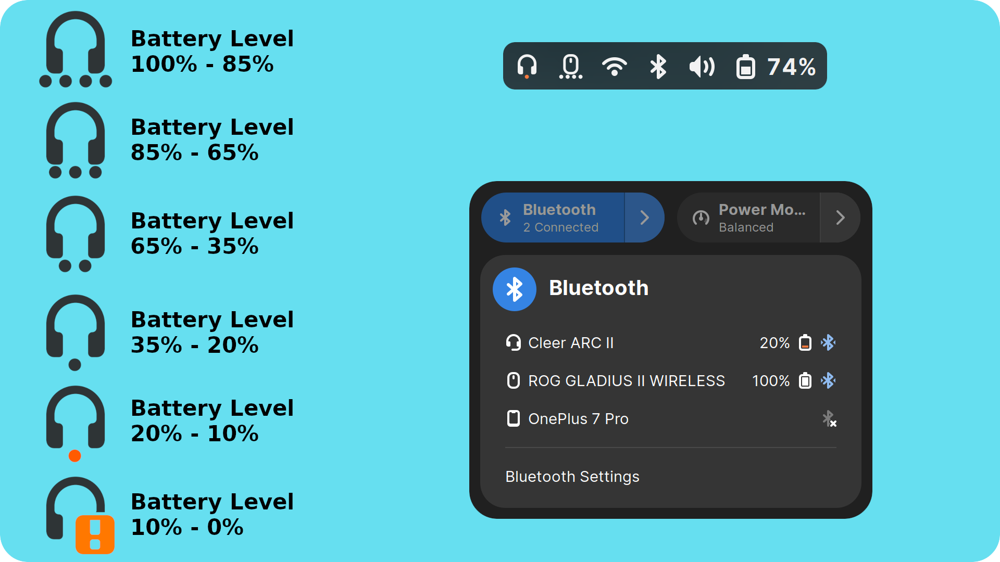

## Bluetooth Battery Meter extension for GNOME shell
<picture>

</picture>
<br>
<br>
<br>

##### An extension featuring indicator icons in the system tray, serving as a meter for Bluetooth device battery levels. It also enhances the Bluetooth menu in the quick settings, providing detailed battery levels (via icon/text).

##### Note: To enable battery level reporting from Bluetooth devices, the Experimental features for Bluez must be activated, as they are disabled by default in most Linux distributions. Please check the Read Me for more details.

<br>

[](https://extensions.gnome.org/extension/5724/bluetooth-battery-level/)

<br>

## Installation

* Extension is available on Gnome Extension website name "Bluetooth Battery".
* Certain Bluetooth devices may not report battery level, and may work only when bluez experimental features are enabled.
* Most Linux distributions ship with bluez experimental features are disabled, but there are some like Fedora 39 ship with it enabled.
* If your bluetooth device doesn't show battery level, check this post and enable bluez experimental feature https://askubuntu.com/a/1420501

## Supported Bluetooth Battery Meter Icons
* Icon are designed by me by editing icons provided by Gnome.
* I found round dot/circle are the only way to convey battery level information as the icon is very small on my high resolution 2560x1440p screen at 100% scaling.
<br>
<br>
<table>
<tr>
<th>Icon type supported</th>
<th>Icon Meter vs Battery Level</th>
</tr>
<tr>

<td>

| Icons Types | Reported by BTclient |
|:-:|:-:|
|  | <b>input-mouse</b> |
|  | <b>input-keyboard</b> |
|  | <b>input-gaming</b> |
|  | <b>input-tablet</b> |
|  | <b>audio-headphone</b> |
|  | <b>audio-headset</b> |
|  | <b>audio-speakers</b> |

</td><td>

| Icon Meter Level | Battery Level |
|:-:|:-:|
|  | 100-85%<br>(approx full charge) |
|  | 85-65%<br>(approx 75%) |
|  | 65-35%<br>(approx 50%) |
|  | 35-20%<br>(approx 25%) |
|  | 20-10%<br>(warning below 20%) |
|  | 10-0%<br>(warning below 10%) |

</td></tr> </table>

## Translation
* Submit a pull request
* Check out my guide for translations. It is for Battery Health Charging extension, but step are similar.
  - [Poedit Guide](https://maniacx.github.io/Battery-Health-Charging/poedit-guide)
  - [Pull Request Guide](https://maniacx.github.io/Battery-Health-Charging/pull-request-guide)
 
 
## Bugs / New Features

#### Bugs
* Before reporting a bug, try to disable the extension, reset the extension gsettings, logout-login and enable the extension. [Raise an issue](https://github.com/maniacx/Bluetooth-Battery-Meter/issues) if bug still persist. Command to reset gsettings
```
gsettings --schemadir /home/$USER/.local/share/gnome-shell/extensions/Bluetooth-Battery-Meter@maniacx.github.com/schemas reset-recursively org.gnome.shell.extensions.Bluetooth-Battery-Meter
```

#### Request New Features
I have build this extension for me according to my requirements, so the feature are limited.
If you want certain feature, please try other extensions that report Bluetooth Battery Level that may fulfill your requirements.
Here are few extensions
* [UPower Battery](https://extensions.gnome.org/extension/5165/upower-battery/) by codilia
* [Bluetooth Quick Connect](https://extensions.gnome.org/extension/1401/bluetooth-quick-connect/) by Extensions Valhalla
* [Bluetooth battery indicator](https://extensions.gnome.org/extension/3991/bluetooth-battery/) by michalwanat

If still need to request a new feature [Raise an issue](https://github.com/maniacx/Bluetooth-Battery-Meter/issues).


## Credits
[List of credits](https://maniacx.github.io/Battery-Health-Charging/credits)
