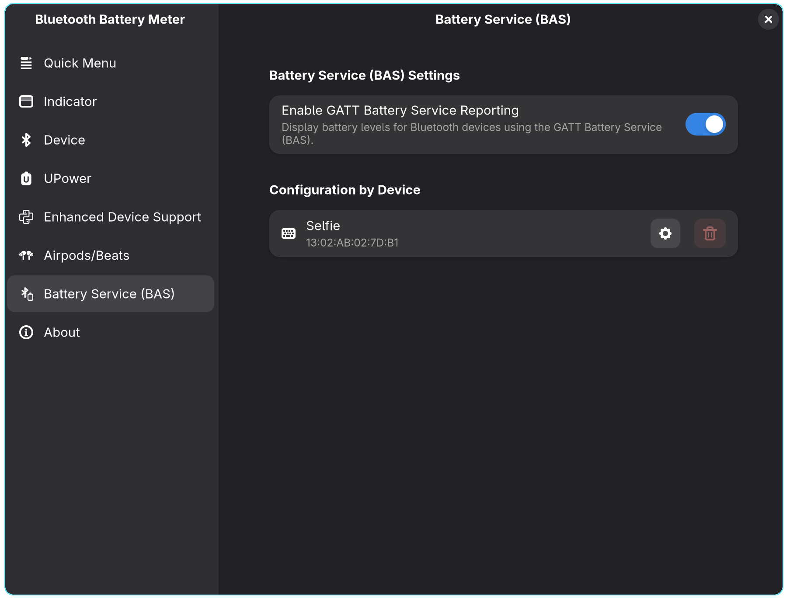
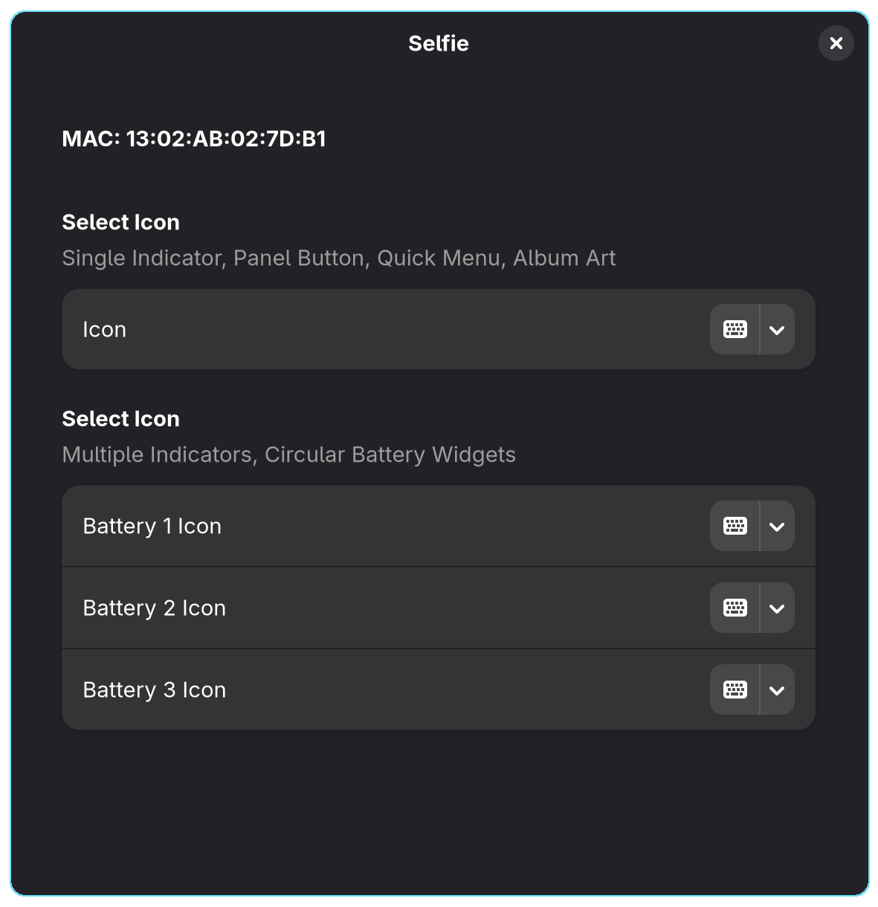
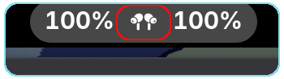
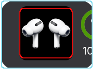
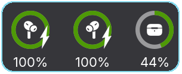

##  Battery Service (BAS)
 
 

{: .note }
>
> This preference is available only when Enhanced Devices is enabled.

**Battery Service (BAS) Preferences**
 

When enabled, the built-in Python script retrieves one or more battery levels reported by the GATT Battery Service for each device.

If your device supports the Battery Service (UUID = 0000180f-0000-1000-8000-00805f9b34fb), it will report its battery level, which will then be displayed by the extension.

## Configuration by Device

Configure per device settings if supported

## Icon Preferences

Allows users to customize the icons displayed for BAS devices.

There are two icon groups available:

---

### Select Icon (Single Indicator, Panel Button, Quick Menu, Album Art)

You can customize the icon by selecting from a list of supported icons.
This section defines a single icon used across various GNOME Shell interface locations:

* **Single Indicator**: Indicator displayed with Multiple Battery Indicator mode disabled.

* **Panel Button**: The icon shown in the GNOME top panel.

* **Quick Menu**: The icon shown in the quick settings dropdown.

* **Album Art**: For media devices, this may appear as a symbolic representation.

---

### Select Icon (Multiple Indicators, Circular Battery Widgets)

This section is for users who want to select **individual battery icons** for

Example: Battery1 icon: left earbud, Battery2 icon: right earbud, and Battery3 icon: case

* Multiple Battery Indicator mode,

* Circular battery widget.

---

### Notes
* These preferences are device-specific and stored per-device.
* Devices must be paired and visible in the GATT BAS list for their icon preferences to be customized.

