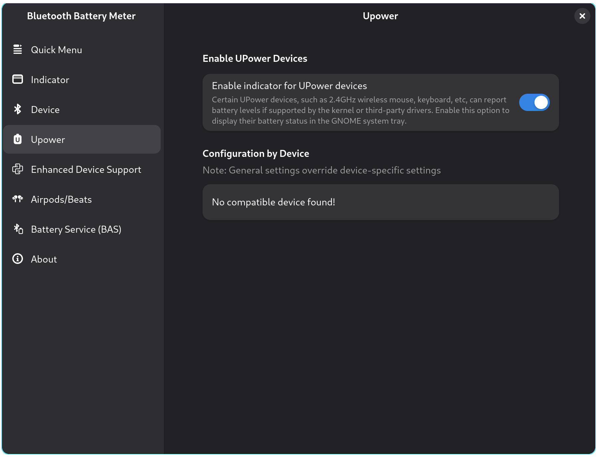

## UPower Settings
 
 

**UPower Preferences**
 

Enabling this feature will display a battery level indicator for UPower devices. This feature was introduced to show the battery status of non-Bluetooth devices, such as Lightspeed keyboards/mice or other peripherals that reports battery levels via UPower.

UPower devices of type power-supply, such as chargers, laptop batteries, or UPS units, are not displayed. Additionally, UPower devices with a native path starting with /org/bluez/ are not shown, as their battery levels are already handled by the Bluetooth indicator.

However, some Bluetooth devices may not report their native path as /org/bluez/. In such cases, there is a possibility of duplicate battery indicators displayed, one from the Bluetooth indicator and another from the UPower indicator. If this happens, you can use the configuration by device option to disable one of the indicators as needed.
