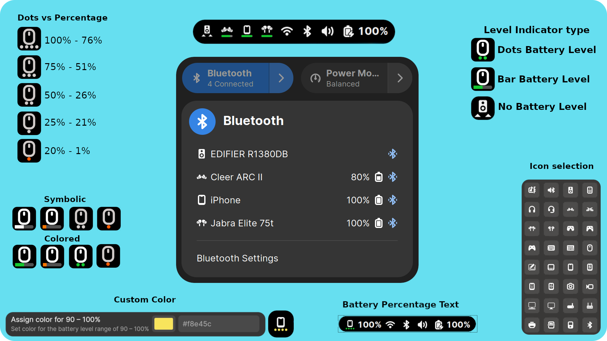

# Bluetooth Battery Meter

{: .important-title }
> Currently supported on Gnome Versions:
> 
> Supported: `43, 44, 45, 46, 47, 48`
>
> Deprecated: `42`

**Bluetooth Battery Meter is a Gnome Extension featuring indicator icons in system tray, serving as meter for Bluetooth device battery levels and providing detailed battery levels via icon/text in the Bluetooth quick settings menu.**
 
 

# Important Notes

---

{: .note }
>
> * Certain Bluetooth devices report battery levels in different increments.
> * One would expect a continuous discharge reading like 100, 99, 98, 97... down to 0.
> * However manufacturers often design devices to report in specific increments.
> * Some devices may report battery levels in increments of 5 (e.g., 100, 95, 90, 85... to 0)
> * Some devices may report battery levels in increments of 10 (e.g., 100, 90, 80, 70... to 0)
> * Some devices may report battery levels in increments of 20 (e.g., 100, 80, 60, 40... to 0)
> * For Quick settings percentage displayed in text (when enabled), might observe battery level stuck at a percentage example 100% for a while and later suddenly drop down to 80%, if designed for increment of 20%.

 

# Features:

## Core Functions (Default Operation Mode)

* Displays battery level (text/icon) reported by BlueZ in the system tray indicator and Bluetooth popup menu.

* Configurable indicator style: battery bar or dots.

* Customizable battery bar and dot colors.

* Shows indicator for non-battery Bluetooth devices (e.g., keyboard, mouse) to reflect connection status.

* Option to disable battery reporting per device.

* Option to choose different icons for each Bluetooth device.

## UPower Devices (Optional Mode)

* When enabled, displays battery level in the system tray for non-Bluetooth UPower devices (e.g., Logitech Lightspeed keyboard/mouse).

* Option to select a custom icon for the indicator.

* Configurable indicator style: battery bar or dots.

* Customizable battery bar and dot colors.

## Enhanced Device Mode (Optional Mode - Requires Python Script)

* The extension uses a built-in Python script to enhance battery reporting and device control. It communicates with supported devices using:

   - Socket-based interface for devices like AirPods/Beats to retrieve battery levels and control features such as ANC.

   - D-Bus GATT Battery Service (BAS) for standard Bluetooth devices that expose battery information via the GATT protocol.

* Provides additional UI widgets to display battery levels and control features such as ANC:

   - Message Tray notifications

   - Panel Button

   - On-hover details

   - Multiple indicator mode
   
