# Bluetooth Battery Meter
[](https://extensions.gnome.org/extension/6670/bluetooth-battery-meter/)
[](https://github.com/maniacx/Bluetooth-Battery-Meter)

{: .important-title }
> Currently supported on Gnome Versions:
> 
> Supported: `43, 44, 45, 46, 47`
>
> Deprecated: `42`


**Bluetooth Battery Meter is a Gnome Extension featuring indicator icons in system tray, serving as meter for Bluetooth device battery levels and providing detailed battery levels via icon/text in the Bluetooth quick settings menu.**
<br>
<br>


# Important Notes

---

{: .note }
>
> * Certain Bluetooth devices report battery levels in different increments.
> * One would expect a continuous discharge reading like 100, 99, 98, 97... down to 0.
> * However manufacturers often design devices to report in specific increments.
> * Some devices may report battery levels in increments of 5 (e.g., 100, 95, 90, 85... to 0)
> * Some devices may report battery levels in increments of 10 (e.g., 100, 90, 80, 70... to 0)
> * Some devices may report battery levels in increments of 20 (e.g., 100, 80, 60, 40... to 0)
> * For Quick settings percentage displayed in text (when enabled), might observe battery level stuck at a percentage example 100% for a while and later suddenly drop down to 80%, if designed for increment of 20%.

<br>

{: .note }
>
> * Certain Bluetooth devices may not report battery level, and may work only when bluez experimental features are enabled.
> * Most Linux distributions ship with bluez experimental features are disabled, but there are some like Fedora 39 ship with it enabled.
> * If your bluetooth device doesn't show battery level, refer the procedure below to enable bluez experimental feature

# Enable Experimental Bluez

---

If bluetooth device is not reporting battery level, it could be that it needs Bluez Experimental.
Note: Some bluetooth devices may also require to enable Bluez kernel experimental feature.
<br>

### Check if experimental feature
To check if experimental feature is enabled or not by try the following command. It will echo if experimental flag is enabled or disabled.
```bash
bluetoothctl show | grep -q 'PowerState' && echo 'Experimental flag enabled' || echo 'Experimental flag disabled'
```

<br>
### Enable experimental feature
There are several ways to enable experimental feature, the easiest way to enable is to edit system file
```
/etc/bluetooth/main.conf
```
Search for the line `#Experimental = false` and remove the `#` and change from `false` to `true`
```
Experimental = true
```
 Restart the bluetooth service using
```
systemctl restart bluetooth
```
Once done check if device displays battery level under `Power` in `Gnome Control Center (Settings)`
<br>
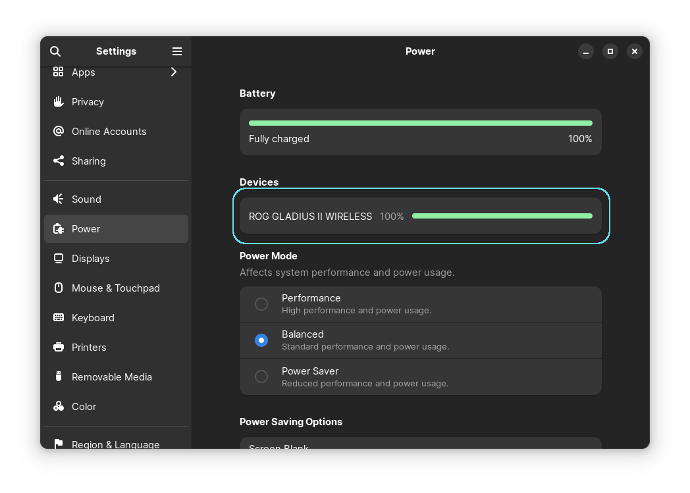

### Enable kernel experimental feature
Users have reported that some devices will not report battery level until the **kernel experimatal** flag is enabled. If the battery level is still not reported. Try to enable bluez kernel experimental feaures
Edit system file
```
/etc/bluetooth/main.conf
```
Search for the line `#KernelExperimental = false` and remove the `#` and change from `false` to `true`
```
KernelExperimental = true
```
 Restart the system.

# Features

---

## **Quick Settings: Display Battery Level Icon In Bluetooth Quick Settings Menu**
An option to add/remove Battery Level icon in Bluetooth quick settings menu. 
<br>
<br>
**Extension Preferences**
<br>
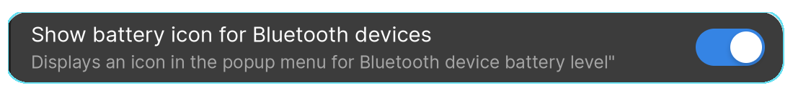
<br>
<br>
**Bluetooth Quick Settings**
<br>
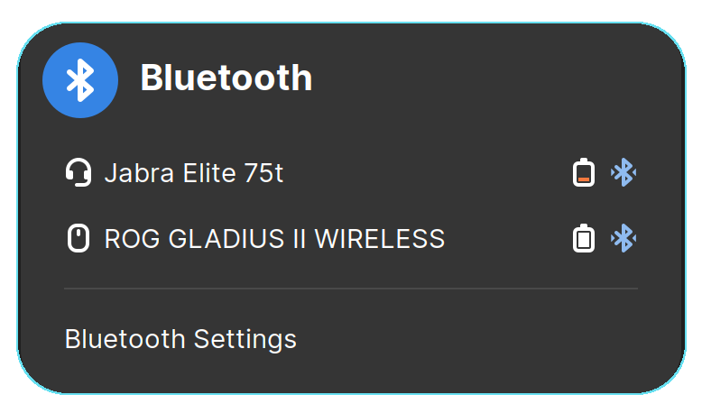

---

## **Quick Settings: Display Battery Percentage In Text In Bluetooth Quick Settings Menu**
An option to add/remove Battery Percentage in text in Bluetooth quick settings menu. 
<br>
<br>
**Extension Preferences**
<br>

<br>
<br>
**Bluetooth Quick Settings**
<br>
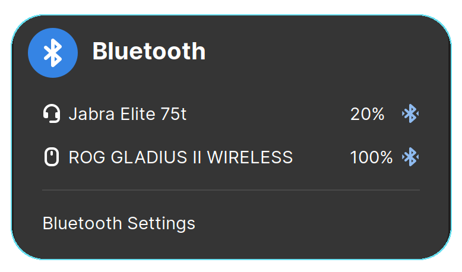

---

## **Quick Settings: Swap Battery Percentage Text With Icon In Bluetooth Quick Settings Menu**
When both, Battery Percentage Text and Battery Level Icon are enabled, Setting this feature to enabled with display Text after Icon, and vice versa
<br>
<br>
**Extension Preferences**
<br>

<br>
<br>
**Bluetooth Quick Settings Icon Before Text Disabled**
<br>
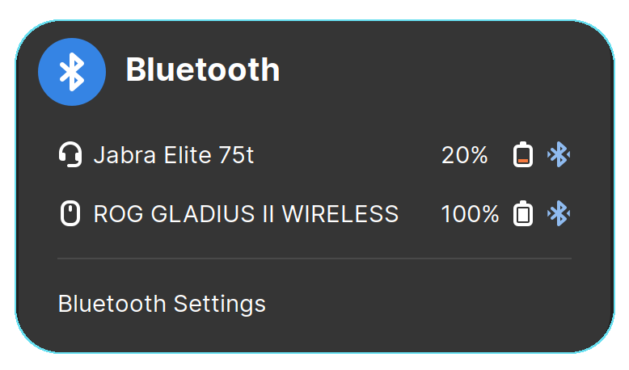
<br>
<br>
**Bluetooth Quick Settings Icon Before Text Enabled**
<br>
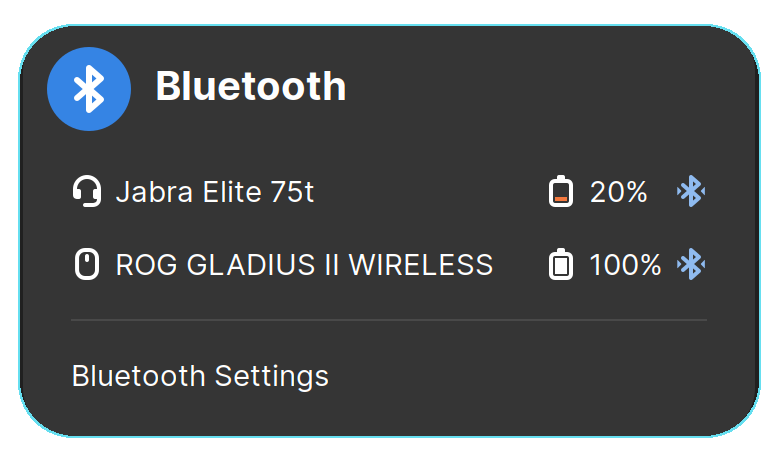
<br>
<br>

---

## **Quick Settings: Sort Devices by Connection Recency**
<br>
<br>
**Extension Preferences**
<br>

<br>
<br>
This setting sorts Bluetooth devices based on their connection history.

- **When disabled:** 
  Devices follow GNOME's default behavior: connected devices are displayed at the top, and paired (disconnected) devices are at the bottom. Both groups are sorted alphabetically.

- **When enabled:** 
  - **Connected devices** are shown at the top, sorted by the most recent connection time. 
  - **Paired devices** are displayed at the bottom, sorted by the most recent disconnection time. 

> **Note:** BlueZ does not provide connection/disconnection times. The extension records these times only when enabled. Initially, all devices will appear unsorted until connection and disconnection events occur.

---

## **Indicators: System Tray Indicators**
This extension provide information by displaying battery Levels of Bluetooth device as a Meter. This help taking minimum space on the system panel without being very intrusive.
<br>
These indicator icon can also be disabled in Extension Preferences
<br>
<br>
**Extension Preferences**
<br>

<br>
<br>
**System Tray Indicators**
<br>


---

## **Indicator: Bluetooth Indicator Show Percentage in text**
Display battery percentage in text next to the indicator icon. 
<br>
<br>
**Extension Preferences**
<br>
<br>
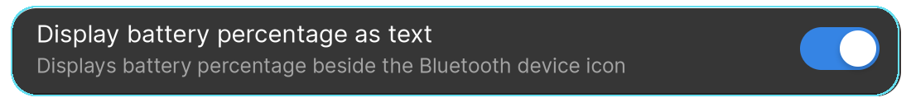
<br>
<br>
**System Tray Indicators**
<br>
<br>

<br>
<br>

---

## **Indicator: Bluetooth Connection Status Indicator**
<br>
<br>
**System Tray Indicators**
<br>
<br>

<br>
**Default GNOME behavior:** When one or more Bluetooth devices are connected, the Bluetooth Connection Status Indicator will be displayed.
<br>
<br>
**Extension Preferences**
<br>
<br>

<br>

This setting provides three options:
- **Default Behavior:** The icon will follow its original behavior as intended by GNOME.
- **Hide Always:** The Bluetooth Connection Status Indicator icon will always be hidden.
- **Hide Conditionally:** The Bluetooth Connection Status Indicator icon will remain hidden if a Bluetooth device indicator is displayed. If no individual Bluetooth device indicator is shown in the system tray, the Bluetooth Connection Status Indicator icon will be displayed.

<br>

---

## **Indicator: Battery Level Type**
<br>
<br>
**Extension Preferences**
<br>
<br>

<br>

Available levels types are Battery Level Bar and Battery Level Bar.
- **Battery Level Bar:** display a battery bar below the device icon.
- **Battery Level Dots:** displays dots representing level of battery.


**Battery Level Bar Mode**


**Battery Level Dots Mode**


| Symbolic | Battery Level |
|:-:|:-:|
|  | Approx. Fully Charge<br>Battery level: 100 - 76%  |
|  | Battery level: 75-51% |
|  | Battery level: 50-26% |
|  | Battery level: 25-20% |
|  | Warning! Below 20%<br>Battery level: 20-0% |

---
## **Indicator: Battery Level Color Scheme**
<br>

<br>

This setting provides three options to customize the color scheme:

- **Symbolic Color:** 
  The color of the bar/dot will match the system indicator's foreground color (typically black or white, depending on the theme) when the battery percentage is greater than 20%.  
  If the battery percentage falls below 20%, the bar/dot will use the system's warning color (usually orange, depending on the theme).


- **Color:** 
  The color of the bar/dot will be **green** when the battery percentage is above 20%, and **orange** when it is 20% or lower.


- **Customize:**
  Allows you to define custom colors for different battery level ranges.
  
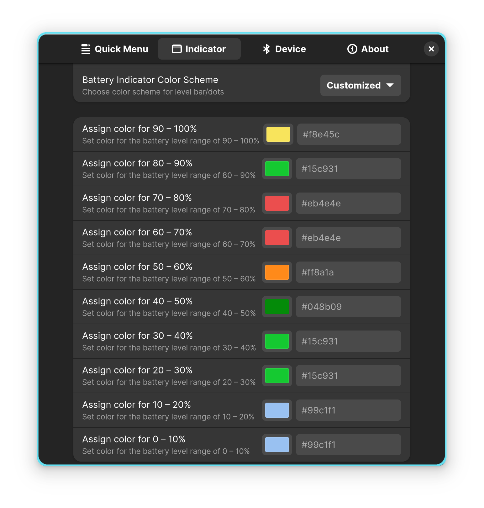

---

## **Configuration By Device**
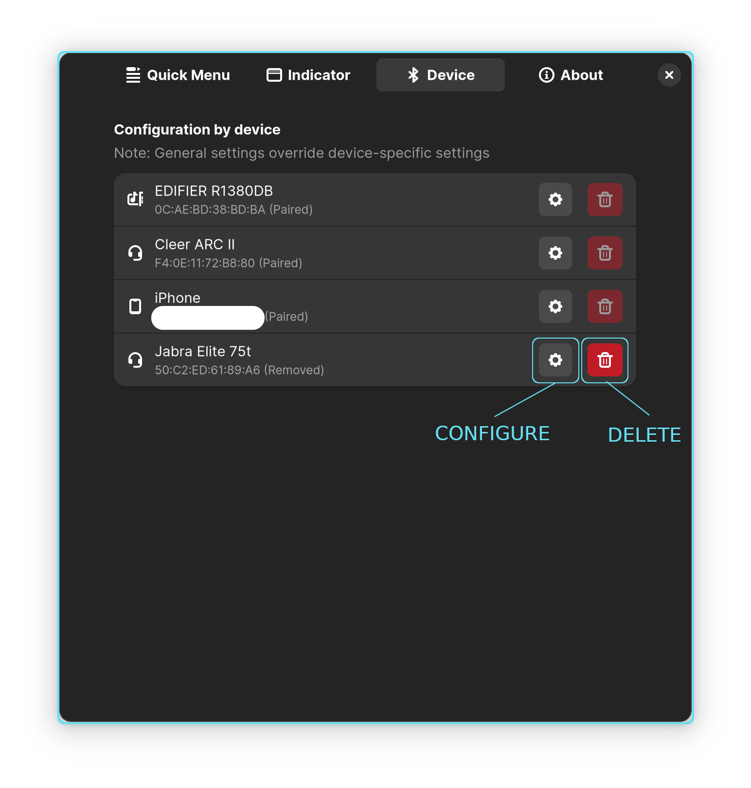

This window allows users to customize device-specific configurations. These settings are stored in **gsettings** and are restored automatically if the Bluetooth device is re-paired.

- **Configure Button:**
  Allows users to customize the icon type (e.g., headphones, earbuds), toggle indicator visibility, and enable/disable quick settings battery level reporting.

- **Delete Button:** 
  If a Bluetooth device is no longer paired or used, the stored configuration can be deleted. This ensures no unnecessary settings remain in **gsettings**.

---
## **Configuration By Device: Configure**

This window provides options to customize device settings and indicates whether **battery reporting** is supported. The available options differ based on the device's battery reporting capabilities.

- **For devices with battery reporting:** 
  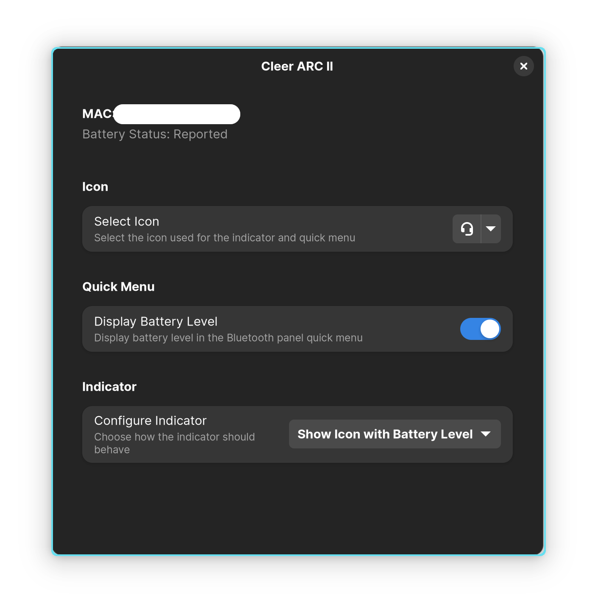

- **For devices without battery reporting:** 
  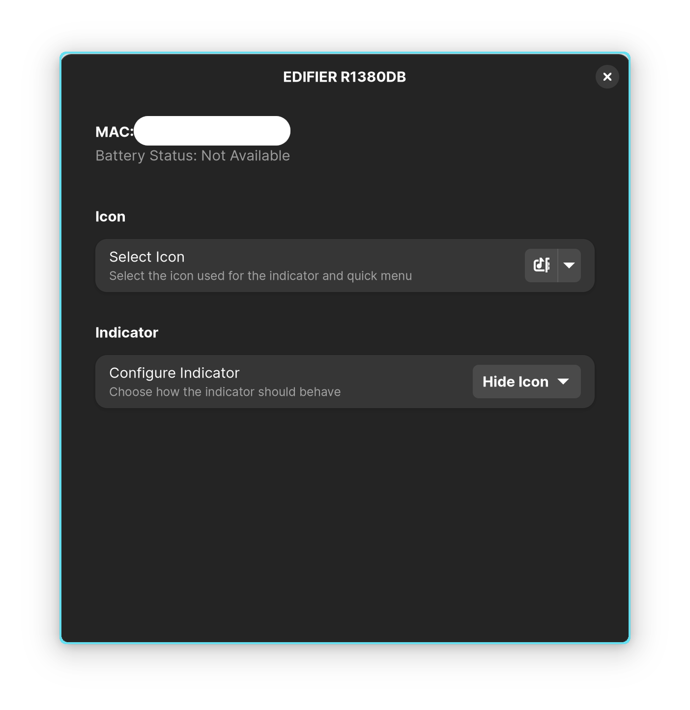

---

## **Configuration By Device: Select Icon**

This setting allows users to customize the device icon displayed in both the quick settings menu and the indicator. A wide range of icons is available to choose from.

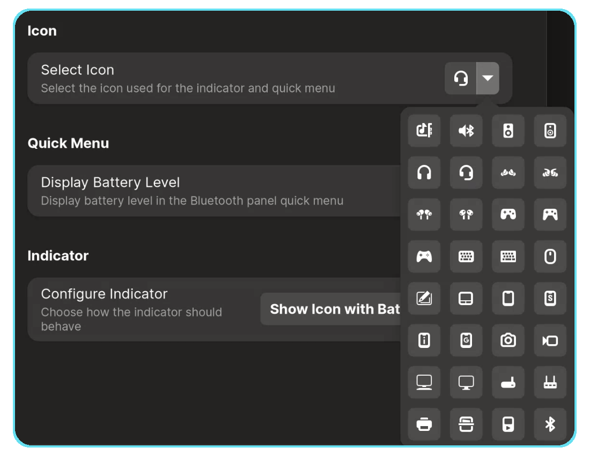

In the example below, the icon is set to **earbuds**, and the changes are applied to both the **indicator** and the **quick settings** icon.

- **Indicator Icon:** 
  

- **Quick Settings Icon:** 
  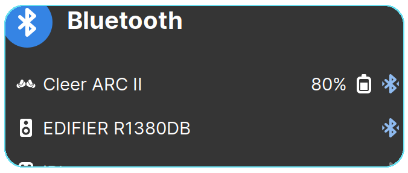

---

## **Configuration By Device: Quick Menu: Display Battery Level**


This setting provides option to hide battery information display in quick menu.
This is particularly useful if an unsupported Bluetooth device (not yet supported by BlueZ) reports incorrect battery levels, allowing users to hide it from the quick settings and the indicator.

---

## **Configuration By Device: Quick Menu: Display Battery Level**

This setting allows users to hide the battery level display in the quick settings menu.


It is particularly useful for unsupported Bluetooth devices (not fully supported by BlueZ) that may report incorrect battery levels, helping users avoid misleading information.

---

## **Configuration By Device: Indicator - Customize Display**


This setting allows users to customize how the indicator is displayed, particularly for devices with inaccurate or missing battery level reporting.

### Available Options:
- **Do not show icon:** 
  Completely hides the indicator.

- **Show icon without battery level:** 
  Displays the indicator without battery information, showing only the icon with two triangles at the bottom. 
  Useful for devices that don’t report battery levels or report them incorrectly but still indicate a connection. 
  For example, a connected externally powered Bluetooth speaker will show a speaker icon in the system tray. 

  

- **Show icon with battery level:**
  Displays the indicator with battery level information, including a bar or dots if the battery level is reported. 

  
  
  

## **UPower devices indicator**

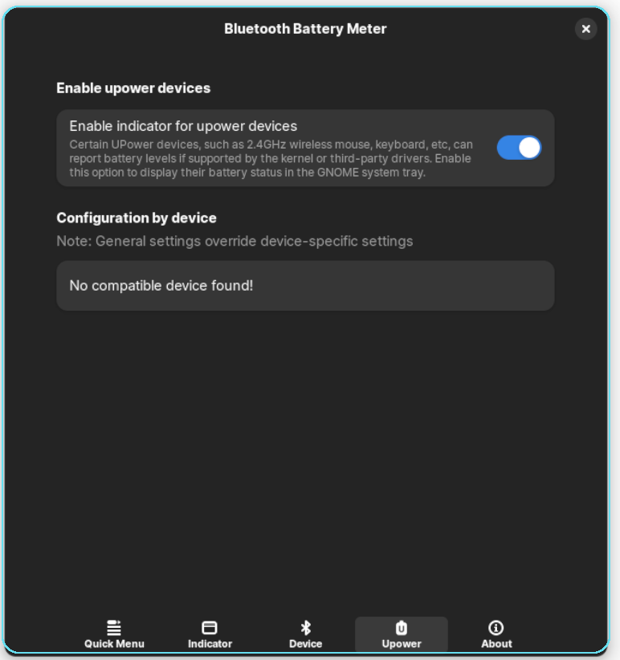

Enabling this feature will display a battery level indicator for UPower devices. This feature was introduced to show the battery status of non-Bluetooth devices, such as Lightspeed keyboards/mice or other peripherals that reports battery levels via UPower.

UPower devices of type power-supply, such as chargers, laptop batteries, or UPS units, are not displayed. Additionally, UPower devices with a native path starting with /org/bluez/ are not shown, as their battery levels are already handled by the Bluetooth indicator.

However, some Bluetooth devices may not report their native path as /org/bluez/. In such cases, there is a possibility of duplicate battery indicators displayed, one from the Bluetooth indicator and another from the UPower indicator. If this happens, you can use the configuration by device option to disable one of the indicators as needed.


